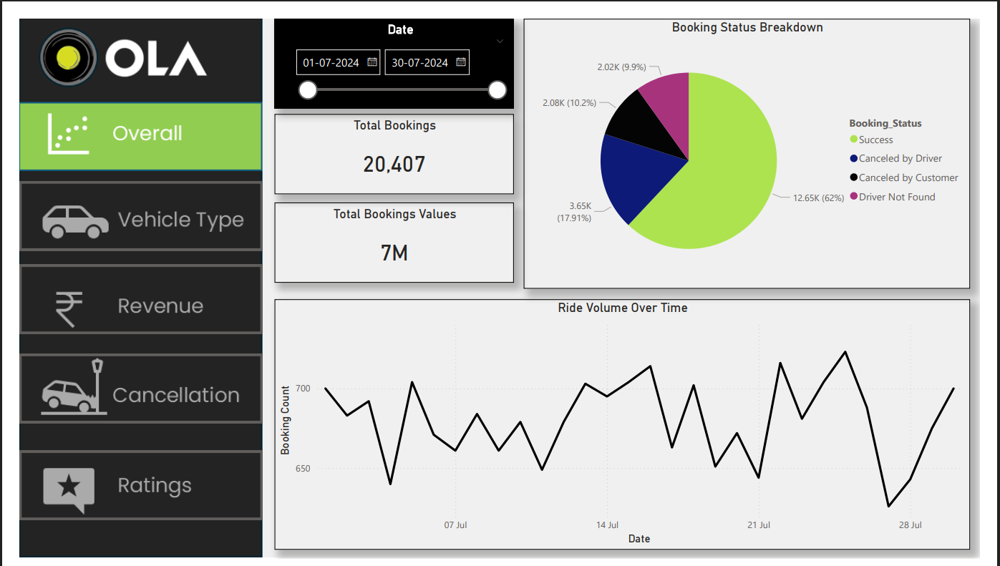
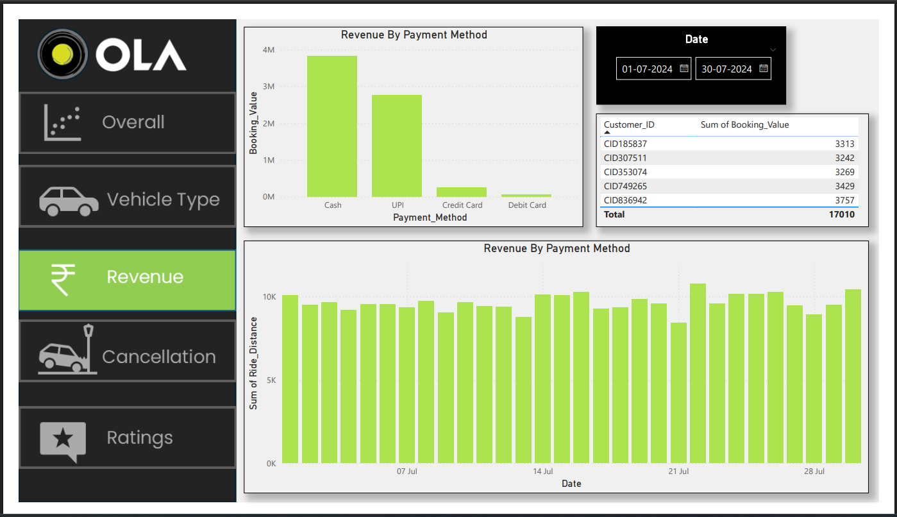
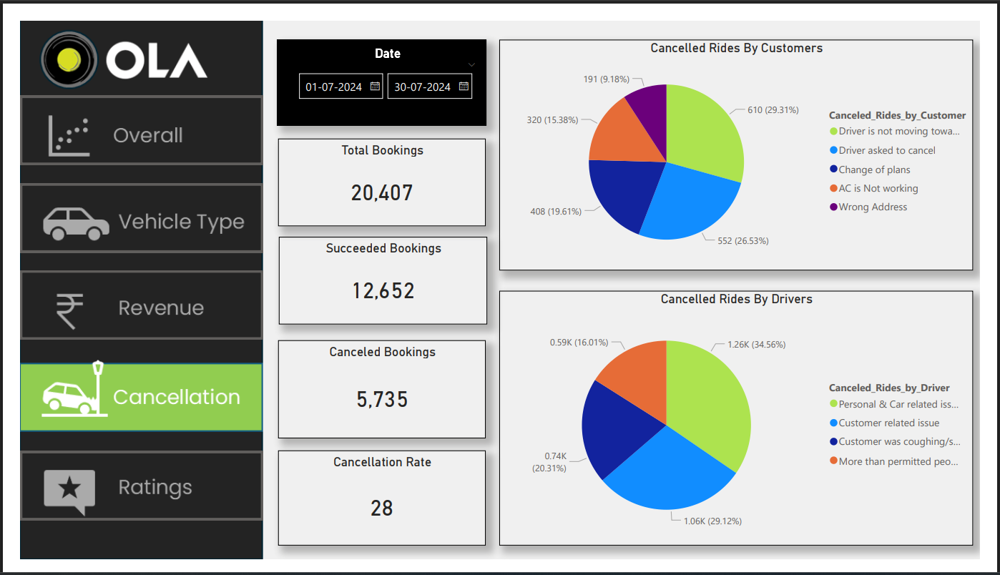
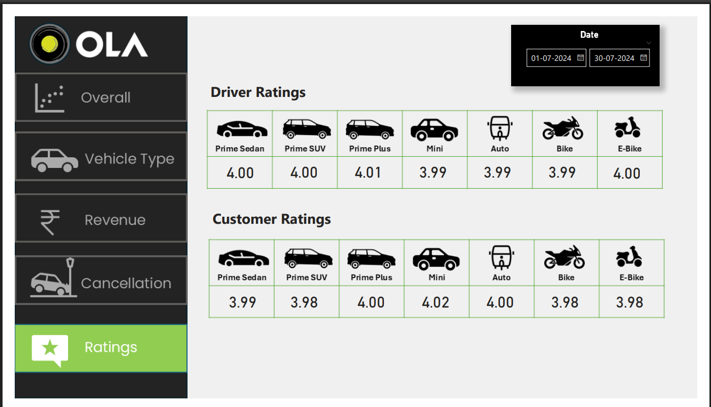

# 🚕 OLA Data Analysis Dashboard (Power BI)

This project presents an end-to-end data analysis of OLA ride bookings using **Power BI**.  
The dashboard helps business teams understand booking trends, revenue, cancellations, vehicle performance, and customer/driver ratings.

---

## 📌 Project Objective
To analyze OLA ride data and build an interactive dashboard that provides:
- Ride performance over time
- Revenue insights
- Vehicle category analysis
- Cancellation behavior
- Driver & customer satisfaction

This dashboard can help OLA improve operations, reduce cancellations, and increase revenue.

---

## 📊 Dashboard Overview

The Power BI dashboard is divided into **5 interactive views**:

### 1️⃣ Overall Performance
- **Total Bookings:** 20,407  
- **Total Booking Value:** ₹7M  
- **Ride Volume Over Time** (daily trend)  
- **Booking Status Breakdown**
  - 62% Successful
  - ~18% Cancelled by Driver
  - ~10% Cancelled by Customer
  - ~10% Driver Not Found  

*(Based on Overall page of the dashboard)*

---

### 2️⃣ Vehicle Type Analysis
Compares different vehicle categories such as:
- Prime Sedan
- Prime SUV
- Prime Plus
- Mini
- Auto
- Bike
- E-Bike

For each vehicle type, the dashboard shows:
- Total Booking Value  
- Successful Booking Value  
- Average Distance Travelled  
- Total Distance Travelled  

This helps identify which vehicle types contribute the most to revenue and distance.

---

### 3️⃣ Revenue Analysis
Shows:
- **Revenue by Payment Method**  
  (Cash, UPI, Credit Card, Debit Card)
- **Top 5 Customers by Booking Value**
- **Ride Distance Per Day**

This view helps understand:
- Which payment methods generate the most revenue
- Who the highest-value customers are
- How travel volume changes daily

---

### 4️⃣ Cancellation Analysis
Breakdown of **why rides are cancelled**:

**Customer Side:**
- Driver not moving towards pickup
- Driver asked to cancel
- Change of plans
- AC not working
- Wrong address

**Driver Side:**
- Personal or vehicle issues
- Customer related issues
- Customer behavior
- Too many passengers

Also shows:
- Total bookings: 20,407  
- Successful bookings: 12,652  
- Cancelled bookings: 5,735  
- Cancellation rate: 28%

This helps OLA identify major cancellation problems.

---

### 5️⃣ Ratings Analysis
Displays:
- **Driver Ratings by Vehicle Type**
- **Customer Ratings by Vehicle Type**

Ratings are around **4.0**, showing generally good service quality.

---

## 🛠 Tools & Technologies Used
- **Power BI Desktop**
- Data Cleaning & Modeling
- DAX Measures
- Interactive Filters & Slicers
- KPI Cards, Line Charts, Bar Charts, Pie Charts, Tables

---

## 📷 Dashboard Screenshots

| Overall | Vehicle Type |
|--------|---------------|
|  |  |

| Revenue | Cancellation |
|--------|----------------|
|  |  |

| Ratings |
|---------|
|  |

---

## 💼 Why this project is strong for Data Analyst roles
This project demonstrates:
- Real-world business KPIs
- Revenue & operations analysis
- Customer & driver behavior insights
- Dashboard design and storytelling
- Power BI professional reporting

---

## 👩‍💻 Author
**Sindhu**  
Aspiring Data Analyst | Power BI | SQL | Python  

